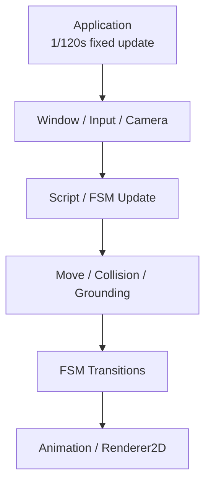

# Rubber GameExample | C++20 / OpenGL 2D Combat Prototype

**English** | [简体中文](README.zh-CN.md) | [Editor branch](https://github.com/AAAiee/GameFramework/tree/Editor)

`GameExample` is a 2D combat demo built with Rubber 2D Engine. The project uses **C++20, OpenGL, and EnTT** and includes character control, ECS, combat state machines, collision, animation, and rendering.

## Demo

<table>
  <tr>
    <td width="50%" align="center">
      <strong>Movement, jumping, and rolling</strong><br><br>
      
    </td>
    <td width="50%" align="center">
      <strong>Four-direction ground attacks</strong><br><br>
      
    </td>
  </tr>
  <tr>
    <td width="50%" align="center">
      <strong>Air attacks</strong><br><br>
      
    </td>
    <td width="50%" align="center">
      <strong>Hit feedback and temporary invulnerability</strong><br><br>
      
    </td>
  </tr>
  <tr>
    <td width="50%" align="center">
      <strong>Invulnerability while rolling</strong><br><br>
      
    </td>
    <td width="50%" align="center">
      <strong>Enemy attack pacing</strong><br><br>
      
    </td>
  </tr>
</table>

## Highlights

- `Application` advances gameplay with a `1/120s` fixed update. `GameLayer` registers 13 systems and processes Window, input, FSM updates, movement, collision, animation, and rendering in a fixed order.
- The player state machine has seven states: Idle, Run, Jump, Fall, Roll, Attack, and Dead. The input system converts the mouse position to world space and uses it to choose one of four attack directions. The player can attack on the ground or in the air.
- Entering the Attack state enables a dedicated hitbox. Leaving the state disables it. The player is invulnerable while rolling. After a hit, the player remains invulnerable for one second and blinks as visual feedback.
- The enemy FSM includes aiming, jumping, air dash, and ground dash states. As its HP falls, the decision interval shortens from 2.0 seconds to 0.75 seconds.
- The engine wraps OpenGL Buffer, VertexArray, Shader, Texture, and Framebuffer resources. It also implements Renderer2D quad batching, Sprite Sheet / Atlas animation, AssetManager, and rendering statistics.

## Runtime architecture

`Scene` owns the EnTT Registry and runs systems in registration order. Each fixed update processes Window / Input / Camera, Script and current-state updates, movement / collision / grounding, and state transitions. Animation and rendering run last.



## Controls

| Input | Action |
|---|---|
| `A` / `D` | Move left or right |
| `W` | Jump |
| `Left Shift` | Roll |
| Left mouse button | Attack toward the mouse cursor |

## Feature → source code

| Feature | Main implementation |
|---|---|
| **Fixed update main loop** | [`Application::run`](Engine/Source/RB/Core/Application.cpp#L108) |
| **EnTT Scene and System scheduling** | [`GameLayer::onAttach`](GameExample/Source/GameLayer.cpp#L21), [`Scene`](Engine/Source/RB/Scene/Scene.cpp#L38) |
| **Action mapping and mouse coordinate conversion** | [`PlayerKeyBindings`](GameExample/Source/Player/PlayerKeyBindings.h#L4), [`InputSystem`](Engine/Source/RB/Scene/System/InputSystem.cpp#L57) |
| **Generic FSM systems** | [`FsmSystem`](Engine/Source/RB/Scene/System/FsmSystem.h#L15), [`FsmPostMovingSystem`](Engine/Source/RB/Scene/System/FsmPostMoving.h#L15) |
| **Player states and four attack directions** | [`PlayerState`](GameExample/Source/Player/PlayerState.h#L5), [`Player::stateMachineInit`](GameExample/Source/Player/Scripts/Player.cpp#L295), [`Player::onAttackEnter`](GameExample/Source/Player/Scripts/Player.cpp#L640) |
| **Roll and post-hit invulnerability** | [`Player::onRollEnter`](GameExample/Source/Player/Scripts/Player.cpp#L678), [`Player::decreaseHP`](GameExample/Source/Player/Scripts/Player.cpp#L738) |
| **Enemy states and decision pacing** | [`Enemy::statesTransitionInit`](GameExample/Source/Enemy/Scripts/Enemy.cpp#L129), [`Enemy::decisionTimeBasedOnHP`](GameExample/Source/Enemy/Scripts/Enemy.cpp#L339) |
| **AABB collision** | [`CollisionSystem`](Engine/Source/RB/Scene/System/CollisionSystem.cpp#L13) |
| **Sprite Sheet / Atlas animation** | [`AnimationSystem`](Engine/Source/RB/Scene/System/AnimationSystem.cpp#L25), [`TextureImporter`](Engine/Source/RB/Resources/TextureImporter.cpp#L28) |
| **Renderer2D** | [`Renderer2D::init`](Engine/Source/RB/Renderer/Renderer2D.cpp#L69), [`Renderer2D::flush`](Engine/Source/RB/Renderer/Renderer2D.cpp#L250) |

## Build instructions

### Requirements

- Windows x64
- Visual Studio 2022 C++ toolchain
- Git with submodule support

### Steps

1. Clone the `GameExample` branch and its submodules:

   ```powershell
   git clone --branch GameExample --recurse-submodules https://github.com/AAAiee/GameFramework.git
   ```

2. Run `Scripts/Setup-Windows.bat` to generate a Visual Studio 2022 solution with the bundled Premake executable.
3. Open the generated `RB Engine.sln` and build the `Game` project.

> [!IMPORTANT]
> The repository no longer includes the third-party image and audio assets. A fresh clone therefore cannot run `GameExample` or reproduce the visuals shown in the GIFs. The gameplay source and demo GIFs remain for code review. To run the project, provide assets you have permission to use, following the paths and frame counts defined in [`AssetMetaDataList.h`](GameExample/Source/AssetMetaDataList.h#L6).

## Demo asset notice

The GIFs show the gameplay and engine systems from the course demo. Some of the visual and audio assets used in the recordings came from [*Katana ZERO*](https://www.devolverdigital.com/games/katana-zero) and [*Hollow Knight*](https://www.hollowknight.com/). Copyrights and trademarks remain with their respective rights holders. This project is not affiliated with the original developers or publishers.

The repository does not include the original image or audio files. The GIFs only record how the demo looked when it was running.
