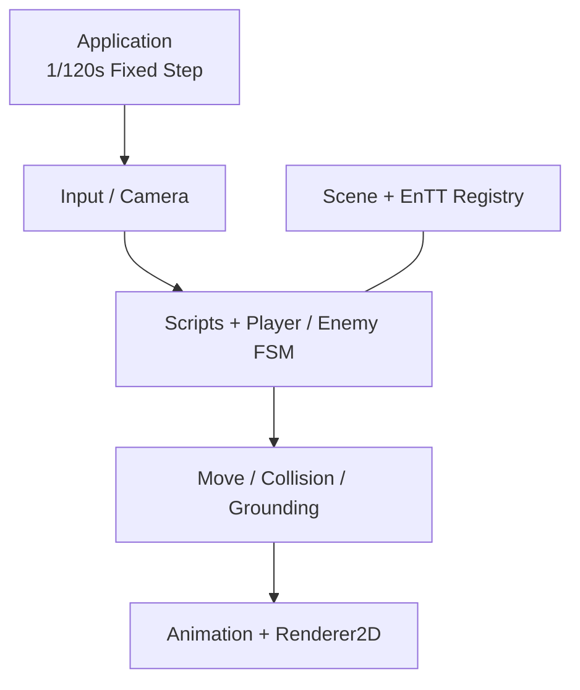

# Rubber GameExample | C++20 / OpenGL 2D Combat Prototype

**简体中文** | [Editor 分支](https://github.com/AAAiee/GameFramework/tree/Editor)

`GameExample` 是基于 Rubber 2D Engine 完成的可玩 2D 战斗 Demo。项目使用 **C++20、OpenGL 和 EnTT**，实现输入、ECS、FSM、碰撞、动画与渲染等核心流程。

## 演示

<table>
  <tr>
    <td width="50%" align="center">
      <strong>移动、跳跃与翻滚</strong><br><br>
      
    </td>
    <td width="50%" align="center">
      <strong>地面四向攻击</strong><br><br>
      
    </td>
  </tr>
  <tr>
    <td width="50%" align="center">
      <strong>空中攻击</strong><br><br>
      
    </td>
    <td width="50%" align="center">
      <strong>受击反馈与短暂无敌</strong><br><br>
      
    </td>
  </tr>
  <tr>
    <td width="50%" align="center">
      <strong>翻滚无敌</strong><br><br>
      
    </td>
    <td width="50%" align="center">
      <strong>敌人攻击节奏</strong><br><br>
      
    </td>
  </tr>
</table>

## 项目亮点

- **固定时间步与 System pipeline：** `Application` 以 `1/120s` fixed timestep 更新 gameplay；`GameLayer` 按顺序调度 Window、Input、Camera、Script、FSM、Move、Collision、Animation 和 Render 等 13 个 System。
- **玩家战斗状态机：** 玩家状态机包含 Idle、Run、Jump、Fall、Roll、Attack 和 Dead 7 个状态。系统将鼠标坐标转换到 world space，据此选择上、下、左、右四个攻击方向，并支持地面与空中攻击。
- **攻击判定与无敌帧：** 攻击开始和结束时启用或关闭独立碰撞体。翻滚期间玩家保持无敌，受击后则进入 1 秒短暂无敌，并通过闪烁给出反馈。
- **敌人行为：** 敌人使用独立 FSM 组织瞄准、跳跃、空中突进和地面突进。随着 HP 降低，决策间隔会从 2.0 秒逐步缩短到 0.75 秒。
- **Engine 基础模块：** 封装 OpenGL Buffer、VertexArray、Shader、Texture 和 Framebuffer，并实现 Renderer2D quad batching、Sprite Sheet / Atlas 动画、AssetManager 与渲染统计。

## Runtime 架构

`Scene` 持有 EnTT Registry 与按顺序执行的 System 列表。每个 fixed timestep 依次更新 Input、Camera、gameplay script 和 FSM，再处理移动、碰撞、落地、动画与渲染。



## 操作方式

| 输入 | 操作 |
|---|---|
| `A` / `D` | 左右移动 |
| `W` | 跳跃 |
| `Left Shift` | 翻滚 |
| 鼠标左键 | 向鼠标所在的 world-space 方向攻击 |

## 功能与源码（Feature → Source Code）

| Feature | 主要实现入口 |
|---|---|
| **Fixed timestep 主循环** | [`Application::run`](Engine/Source/RB/Core/Application.cpp#L108) |
| **EnTT Scene 与 System 调度** | [`GameLayer::onAttach`](GameExample/Source/GameLayer.cpp#L21)、[`Scene`](Engine/Source/RB/Scene/Scene.cpp#L38) |
| **Action Mapping 与鼠标坐标转换** | [`PlayerKeyBindings`](GameExample/Source/Player/PlayerKeyBindings.h#L4)、[`InputSystem`](Engine/Source/RB/Scene/System/InputSystem.cpp#L57) |
| **通用 FSM System** | [`FsmSystem`](Engine/Source/RB/Scene/System/FsmSystem.h#L15)、[`FsmPostMovingSystem`](Engine/Source/RB/Scene/System/FsmPostMoving.h#L15) |
| **玩家状态与四向攻击** | [`PlayerState`](GameExample/Source/Player/PlayerState.h#L5)、[`Player::stateMachineInit`](GameExample/Source/Player/Scripts/Player.cpp#L295)、[`Player::onAttackEnter`](GameExample/Source/Player/Scripts/Player.cpp#L640) |
| **翻滚与受击无敌** | [`Player::onRollEnter`](GameExample/Source/Player/Scripts/Player.cpp#L678)、[`Player::decreaseHP`](GameExample/Source/Player/Scripts/Player.cpp#L738) |
| **敌人状态与决策节奏** | [`Enemy::statesTransitionInit`](GameExample/Source/Enemy/Scripts/Enemy.cpp#L129)、[`Enemy::decisionTimeBasedOnHP`](GameExample/Source/Enemy/Scripts/Enemy.cpp#L339) |
| **AABB Collision** | [`CollisionSystem`](Engine/Source/RB/Scene/System/CollisionSystem.cpp#L13) |
| **Sprite Sheet / Atlas 动画** | [`AnimationSystem`](Engine/Source/RB/Scene/System/AnimationSystem.cpp#L25)、[`TextureImporter`](Engine/Source/RB/Resources/TextureImporter.cpp#L28) |
| **Renderer2D** | [`Renderer2D::init`](Engine/Source/RB/Renderer/Renderer2D.cpp#L69)、[`Renderer2D::flush`](Engine/Source/RB/Renderer/Renderer2D.cpp#L250) |

## 构建说明

### 环境

- Windows x64
- Visual Studio 2022 C++ toolchain
- Git（需要初始化 submodules）

### 步骤

1. 克隆 `GameExample` 分支并拉取 submodules：

   ```powershell
   git clone --branch GameExample --recurse-submodules https://github.com/AAAiee/GameFramework.git
   ```

2. 运行 `Scripts/Setup-Windows.bat`，使用仓库内的 Premake 生成 Visual Studio 2022 solution。
3. 打开生成的 `RB Engine.sln`，构建 `Game` project。

> [!IMPORTANT]
> 公开仓库不再分发 Demo 使用的第三方图片和音频，因此克隆后的 `GameExample` 不能直接运行或还原 GIF 中的画面。仓库保留 gameplay 源码和演示 GIF 供代码审阅；若要运行，请使用拥有合法授权的素材，并按 [`AssetMetaDataList.h`](GameExample/Source/AssetMetaDataList.h#L6) 中的路径与帧数配置替换。

## 项目范围

- 这是课程学习项目，目标是练习小型 2D Engine 与 gameplay 系统的实现，不面向生产环境。
- 目前主要通过手动运行 Demo 检查功能，仓库尚未配置自动化测试与 CI。
- Renderer2D 已实现基础 batching。texture slots 用尽时会触发断言，还不会自动结束当前 batch 并开启下一批。
- 更完整的场景编辑、YAML serialization 与 Editor workflow 位于 [`Editor`](https://github.com/AAAiee/GameFramework/tree/Editor) 分支。

## Demo 素材说明

本分支保留 GIF，用于展示课程项目中的 gameplay 与 engine 功能。录制 Demo 时使用的部分视觉和音频素材来自 [*Katana ZERO*](https://www.devolverdigital.com/games/katana-zero) 与 [*Hollow Knight*](https://www.hollowknight.com/)，相关版权与商标归各自权利人所有；本项目与原作者及发行商无关联。

为避免重新分发第三方原始素材，公开仓库不提供对应的图片和音频文件。GIF 仅用于记录和展示课程 Demo，不代表相关素材可以被复制或再次使用。
