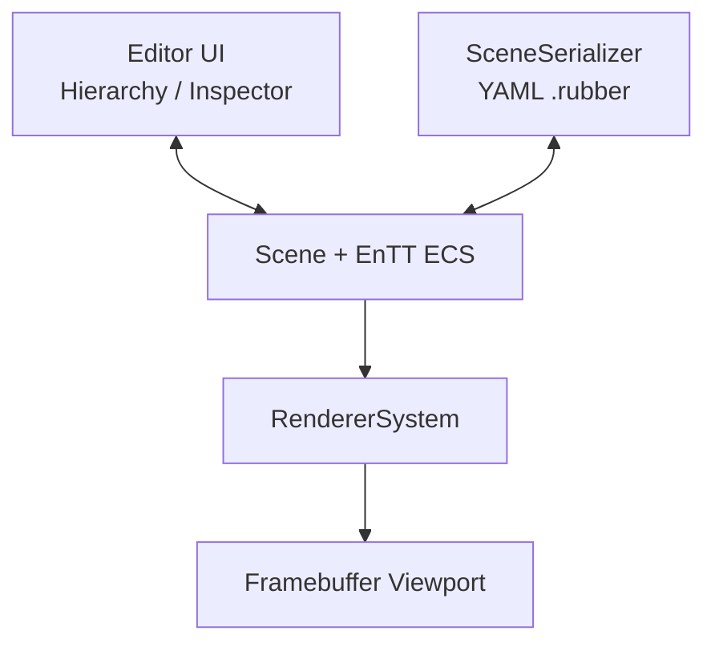

# Rubber Editor | C++20 / OpenGL 2D Engine Editor

**简体中文** | [GameExample 分支](https://github.com/AAAiee/GameFramework/tree/GameExample)

Rubber 是一个基于 **C++20、OpenGL、EnTT 和 Dear ImGui** 的 2D Engine 学习项目。`Editor` 分支提供基础场景编辑器，可创建和管理 Entity、编辑 Component、在独立 Viewport 中预览场景，并将场景保存为可重新加载的 `.rubber` 文件。

## 演示

### Editor 布局与场景保存

<p align="center">
  
</p>

<table>
  <tr>
    <td width="50%" align="center">
      <strong>Entity 选择与 Inspector</strong><br><br>
      
    </td>
    <td width="50%" align="center">
      <strong>添加与移除 Component</strong><br><br>
      
    </td>
  </tr>
  <tr>
    <td width="50%" align="center">
      <strong>Camera Component</strong><br><br>
      
    </td>
    <td width="50%" align="center">
      <strong>创建 Entity 并编辑场景</strong><br><br>
      
    </td>
  </tr>
</table>

## 项目亮点

- **可停靠 Editor UI：** 使用 Dear ImGui 搭建 Dockspace、Scene Hierarchy、Property Inspector、Viewport 与 runtime stats 面板，各区域可以重新停靠和调整布局。
- **ECS 场景数据：** `Scene` 使用 EnTT Registry 管理 Entity 与 Component，并用轻量 `Entity` wrapper 封装 Component 的添加、移除、查询与访问。
- **Hierarchy 与 Inspector：** 支持在 Scene Hierarchy 中创建、删除和选择 Entity。Inspector 可编辑 `Tag`、`Transform`、`Visibility`、`Camera` 和 Sprite color，并按需添加或移除 Component。
- **独立 Viewport：** Scene 先渲染到 OpenGL Framebuffer，再显示到 Editor Viewport。Viewport 尺寸变化时，Framebuffer 与非固定宽高比 Camera 的 aspect ratio 会同步更新。
- **场景保存与加载：** 使用 yaml-cpp 将场景写入 `.rubber` 文件，并从文件恢复 Entity 及其 Component。当前覆盖 Tag、Transform、Camera、Sprite color 与 Visibility。
- **Engine runtime：** Engine 还包含 `1/120s` fixed timestep、OpenGL Renderer2D、渲染统计和采用 current / next 双队列的类型化 EventManager。

## Editor 架构

Editor UI 直接编辑 `Scene` 中的 ECS 数据。RendererSystem 将场景输出到 Framebuffer，Viewport 只负责显示结果；SceneSerializer 则在 Scene 与 `.rubber` 文件之间转换数据。



## 当前 Editor 功能

| 区域 | 已实现功能 |
|---|---|
| Scene Hierarchy | 创建、删除、选择 Entity |
| Property Inspector | 编辑 Tag、Transform、Visibility、Camera 与 Sprite color；添加或移除 Component |
| Camera | Orthographic / Perspective 切换、FOV / Size、Near / Far Clip、Primary 与固定宽高比 |
| Viewport | Framebuffer 离屏渲染、随面板尺寸调整、Camera aspect ratio 更新 |
| File | New、Open、Save As；支持 `Ctrl+N`、`Ctrl+O`、`Ctrl+S` |
| Stats | Draw Calls、Quad / Vertex / Index 数量、Frame Time 与 FPS |

## 功能与源码（Feature → Source Code）

| Feature | 主要实现入口 |
|---|---|
| **Dockspace、Viewport 与文件操作** | [`EditorLayer::onImGuiRender`](Editor/src/EditorLayer.cpp#L62)、[`New / Open / Save`](Editor/src/EditorLayer.cpp#L175) |
| **Scene Hierarchy 与 Inspector** | [`SceneHierachyPanel::onImGuiRender`](Editor/src/Panels/SceneHierachyPanel.cpp#L134)、[`drawComponentNode`](Editor/src/Panels/SceneHierachyPanel.cpp#L212) |
| **Scene 与 System 初始化** | [`Scene::createEntity`](Engine/Source/Rubber/Scene/Scene.cpp#L15)、[`Scene::systemsInit`](Engine/Source/Rubber/Scene/Scene.cpp#L51) |
| **Entity Component API** | [`Entity`](Engine/Source/Rubber/Scene/Utili/Entity.h#L8) |
| **YAML 场景保存与加载** | [`SceneSerializer::serialize`](Engine/Source/Rubber/Scene/Utili/Serializer/SceneSerializer.cpp#L153)、[`deserialize`](Engine/Source/Rubber/Scene/Utili/Serializer/SceneSerializer.cpp#L183) |
| **Framebuffer Viewport** | [`EditorLayer::onUpdate`](Editor/src/EditorLayer.cpp#L42)、[`GLFrameBuffer::resize`](Engine/Source/Platform/OpenGL/GLFrameBuffer.cpp#L47) |
| **Scene 渲染** | [`RendererSystem::onUpdate`](Engine/Source/Rubber/Scene/System/RenderSystem.cpp#L21)、[`Renderer2D`](Engine/Source/Rubber/Renderer/Renderer2D.cpp#L66) |
| **Camera projection** | [`SceneCamera`](Engine/Source/Rubber/Scene/SceneCamera.cpp#L12) |
| **双队列 EventManager** | [`EventManager::dispatchAllEvents`](Engine/Source/Rubber/Event/EventManager.cpp#L8) |
| **Fixed timestep 主循环** | [`Application::run`](Engine/Source/Rubber/Core/Application.cpp#L122) |

## 构建与运行

### 环境

- Windows x64
- Visual Studio 2022 C++ toolchain
- Git（需要初始化 submodules）

### 步骤

1. 克隆默认的 `Editor` 分支并拉取 submodules：

   ```powershell
   git clone --branch Editor --recurse-submodules https://github.com/AAAiee/GameFramework.git
   ```

2. 运行 `Scripts/Setup-Windows.bat`，使用仓库内的 Premake 生成 Visual Studio 2022 solution。
3. 打开生成的 `Rubber Engine.sln`，构建并运行 `Editor` project。

## 项目范围

- `Editor` 是课程学习项目，目前聚焦 ECS 场景编辑、Viewport 渲染和序列化流程。
- Entity 目前通过 Scene Hierarchy 选择，尚未实现 Viewport picking、Transform Gizmo、Undo / Redo、Play Mode 与 Asset Browser。
- SceneSerializer 尚未保存 texture reference；Entity UUID 仍是占位值，runtime serialization 也未完成。
- 目前主要通过手动运行 Editor Demo 检查功能，仓库尚未配置自动化测试与 CI。

Gameplay FSM、碰撞、动画与可玩 combat demo 位于 [`GameExample`](https://github.com/AAAiee/GameFramework/tree/GameExample) 分支。
