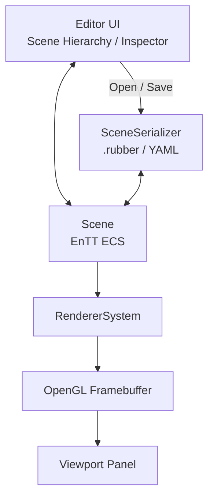

# Rubber Editor | C++20 / OpenGL 2D Engine

**English** | [简体中文](README.zh-CN.md) | [GameExample branch](https://github.com/AAAiee/GameFramework/tree/GameExample)

Rubber is an educational 2D engine project written with **C++20, OpenGL, EnTT, and Dear ImGui**. The `Editor` branch contains a scene editor for managing entities, editing components, previewing scenes, and saving and reloading `.rubber` scene files.

## Demo

### Editor layout and scene save/load

<p align="center">
  
</p>

<table>
  <tr>
    <td width="50%" align="center">
      <strong>Entity selection and Inspector</strong><br><br>
      
    </td>
    <td width="50%" align="center">
      <strong>Add and remove components</strong><br><br>
      
    </td>
  </tr>
  <tr>
    <td width="50%" align="center">
      <strong>Camera component</strong><br><br>
      
    </td>
    <td width="50%" align="center">
      <strong>Create an entity and edit the scene</strong><br><br>
      
    </td>
  </tr>
</table>

## Highlights

- The Editor UI uses a Dear ImGui Dockspace with Scene Hierarchy, Property Inspector, Viewport, and rendering statistics panels. Each panel can be docked and rearranged.
- `Scene` stores entities and components in an EnTT Registry. A lightweight `Entity` wrapper handles component addition, removal, queries, and access.
- Scene Hierarchy can create, delete, and select entities. The Inspector edits `Tag`, `Transform`, `Visibility`, `Camera`, and sprite color, and can add or remove components.
- `RendererSystem` renders the scene into an OpenGL framebuffer for display in the Editor Viewport. Resizing the Viewport also resizes the framebuffer and updates the aspect ratio of cameras that do not use a fixed aspect ratio.
- yaml-cpp saves and loads `.rubber` scene files. Serialization currently covers `Tag`, `Transform`, `Camera`, sprite color, and `Visibility` data.
- The engine also includes a `1/120s` fixed update, an OpenGL Renderer2D, rendering statistics, and a typed EventManager with separate current and next queues.

## Editor architecture

The Editor UI modifies ECS data stored in `Scene`. `RendererSystem` renders the scene into a framebuffer, which the Viewport displays. `SceneSerializer` reads and writes `.rubber` scene files.



## Editor features

| Area | Available functionality |
|---|---|
| Scene Hierarchy | Create, delete, and select entities |
| Property Inspector | Edit Tag, Transform, Visibility, Camera, and sprite color; add or remove components |
| Camera | Orthographic / Perspective projection, FOV / Size, Near / Far Clip, Primary camera, and fixed aspect ratio |
| Viewport | Off-screen rendering through a framebuffer, resizing with the panel, and aspect-ratio updates for cameras without a fixed aspect ratio |
| File | New, Open, and Save As; `Ctrl+N`, `Ctrl+O`, and `Ctrl+S` shortcuts |
| Stats | Draw Calls, Quad / Vertex / Index counts, Frame Time, and FPS |

## Feature → source code

| Feature | Main implementation |
|---|---|
| **Dockspace, Viewport, and file operations** | [`EditorLayer::onImGuiRender`](Editor/src/EditorLayer.cpp#L62), [`New / Open / Save`](Editor/src/EditorLayer.cpp#L175) |
| **Scene Hierarchy and Inspector** | [`SceneHierachyPanel::onImGuiRender`](Editor/src/Panels/SceneHierachyPanel.cpp#L134), [`drawComponentNode`](Editor/src/Panels/SceneHierachyPanel.cpp#L212) |
| **Scene and system initialization** | [`Scene::createEntity`](Engine/Source/Rubber/Scene/Scene.cpp#L15), [`Scene::systemsInit`](Engine/Source/Rubber/Scene/Scene.cpp#L51) |
| **Entity Component API** | [`Entity`](Engine/Source/Rubber/Scene/Utili/Entity.h#L8) |
| **YAML scene save/load** | [`SceneSerializer::serialize`](Engine/Source/Rubber/Scene/Utili/Serializer/SceneSerializer.cpp#L153), [`deserialize`](Engine/Source/Rubber/Scene/Utili/Serializer/SceneSerializer.cpp#L183) |
| **Framebuffer Viewport** | [`EditorLayer::onUpdate`](Editor/src/EditorLayer.cpp#L42), [`GLFrameBuffer::resize`](Engine/Source/Platform/OpenGL/GLFrameBuffer.cpp#L47) |
| **Scene rendering** | [`RendererSystem::onUpdate`](Engine/Source/Rubber/Scene/System/RenderSystem.cpp#L21), [`Renderer2D`](Engine/Source/Rubber/Renderer/Renderer2D.cpp#L66) |
| **Camera projection** | [`SceneCamera`](Engine/Source/Rubber/Scene/SceneCamera.cpp#L12) |
| **Dual-queue EventManager** | [`EventManager::dispatchAllEvents`](Engine/Source/Rubber/Event/EventManager.cpp#L8) |
| **Fixed update main loop** | [`Application::run`](Engine/Source/Rubber/Core/Application.cpp#L122) |

## Build and run

### Requirements

- Windows x64
- Visual Studio 2022 C++ toolchain
- Git with submodule support

### Steps

1. Clone the default `Editor` branch and its submodules:

   ```powershell
   git clone --branch Editor --recurse-submodules https://github.com/AAAiee/GameFramework.git
   ```

2. Run `Scripts/Setup-Windows.bat` to generate a Visual Studio 2022 solution with the bundled Premake executable.
3. Open the generated `Rubber Engine.sln`, then build and run the `Editor` project.
