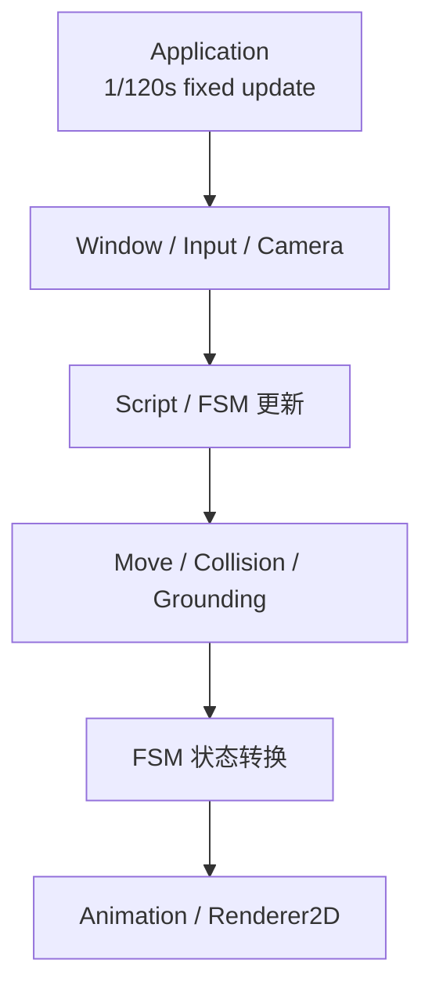

# Rubber GameExample | C++20 / OpenGL 2D Combat Prototype

**简体中文** | [English](README.md) | [Editor 分支](https://github.com/AAAiee/GameFramework/tree/Editor)

`GameExample` 是使用 Rubber 2D Engine 编写的 2D 战斗 Demo。项目基于 **C++20、OpenGL 和 EnTT**，包含角色控制、ECS、战斗状态机、碰撞、动画和渲染。

## 演示

<table>
  <tr>
    <td width="50%" align="center">
      <strong>移动、跳跃与翻滚</strong><br><br>
      
    </td>
    <td width="50%" align="center">
      <strong>地面四向攻击</strong><br><br>
      
    </td>
  </tr>
  <tr>
    <td width="50%" align="center">
      <strong>空中攻击</strong><br><br>
      
    </td>
    <td width="50%" align="center">
      <strong>受击反馈与短暂无敌</strong><br><br>
      
    </td>
  </tr>
  <tr>
    <td width="50%" align="center">
      <strong>翻滚无敌</strong><br><br>
      
    </td>
    <td width="50%" align="center">
      <strong>敌人攻击节奏</strong><br><br>
      
    </td>
  </tr>
</table>

## 项目亮点

- `Application` 以 `1/120s` fixed update 更新 gameplay；`GameLayer` 注册 13 个 System，并按固定顺序处理 Window、输入、FSM、移动、碰撞、动画和渲染。
- 玩家状态机包含 Idle、Run、Jump、Fall、Roll、Attack 和 Dead 7 个状态。输入系统将鼠标坐标转换到 world space，再据此确定上、下、左、右四个攻击方向。玩家可以在地面和空中攻击。
- 进入 Attack 状态时启用独立 hitbox，退出状态时关闭。翻滚期间玩家保持无敌，受击后会获得 1 秒短暂无敌，并通过闪烁显示受击反馈。
- 敌人 FSM 包含瞄准、跳跃、空中突进和地面突进等状态。随着 HP 降低，决策间隔会从 2.0 秒缩短到 0.75 秒。
- Engine 层封装了 OpenGL Buffer、VertexArray、Shader、Texture 和 Framebuffer，并实现 Renderer2D quad batching、Sprite Sheet / Atlas 动画、AssetManager 和渲染统计。

## Runtime 架构

`Scene` 持有 EnTT Registry，并按注册顺序执行 System。每次 fixed update 依次处理 Window / Input / Camera、Script 与当前状态更新、移动 / 碰撞 / 落地、状态转换，最后更新动画并渲染画面。



## 操作方式

| 输入 | 操作 |
|---|---|
| `A` / `D` | 左右移动 |
| `W` | 跳跃 |
| `Left Shift` | 翻滚 |
| 鼠标左键 | 朝鼠标方向攻击 |

## 功能与源码（Feature → Source Code）

| Feature | 主要实现入口 |
|---|---|
| **Fixed update 主循环** | [`Application::run`](Engine/Source/RB/Core/Application.cpp#L108) |
| **EnTT Scene 与 System 调度** | [`GameLayer::onAttach`](GameExample/Source/GameLayer.cpp#L21)、[`Scene`](Engine/Source/RB/Scene/Scene.cpp#L38) |
| **Action Mapping 与鼠标坐标转换** | [`PlayerKeyBindings`](GameExample/Source/Player/PlayerKeyBindings.h#L4)、[`InputSystem`](Engine/Source/RB/Scene/System/InputSystem.cpp#L57) |
| **通用 FSM System** | [`FsmSystem`](Engine/Source/RB/Scene/System/FsmSystem.h#L15)、[`FsmPostMovingSystem`](Engine/Source/RB/Scene/System/FsmPostMoving.h#L15) |
| **玩家状态与四向攻击** | [`PlayerState`](GameExample/Source/Player/PlayerState.h#L5)、[`Player::stateMachineInit`](GameExample/Source/Player/Scripts/Player.cpp#L295)、[`Player::onAttackEnter`](GameExample/Source/Player/Scripts/Player.cpp#L640) |
| **翻滚与受击无敌** | [`Player::onRollEnter`](GameExample/Source/Player/Scripts/Player.cpp#L678)、[`Player::decreaseHP`](GameExample/Source/Player/Scripts/Player.cpp#L738) |
| **敌人状态与决策节奏** | [`Enemy::statesTransitionInit`](GameExample/Source/Enemy/Scripts/Enemy.cpp#L129)、[`Enemy::decisionTimeBasedOnHP`](GameExample/Source/Enemy/Scripts/Enemy.cpp#L339) |
| **AABB Collision** | [`CollisionSystem`](Engine/Source/RB/Scene/System/CollisionSystem.cpp#L13) |
| **Sprite Sheet / Atlas 动画** | [`AnimationSystem`](Engine/Source/RB/Scene/System/AnimationSystem.cpp#L25)、[`TextureImporter`](Engine/Source/RB/Resources/TextureImporter.cpp#L28) |
| **Renderer2D** | [`Renderer2D::init`](Engine/Source/RB/Renderer/Renderer2D.cpp#L69)、[`Renderer2D::flush`](Engine/Source/RB/Renderer/Renderer2D.cpp#L250) |

## 构建说明

### 环境

- Windows x64
- Visual Studio 2022 C++ toolchain
- Git（需要初始化 submodules）

### 步骤

1. 克隆 `GameExample` 分支并拉取 submodules：

   ```powershell
   git clone --branch GameExample --recurse-submodules https://github.com/AAAiee/GameFramework.git
   ```

2. 运行 `Scripts/Setup-Windows.bat`，使用仓库内的 Premake 生成 Visual Studio 2022 solution。
3. 打开生成的 `RB Engine.sln`，构建 `Game` 项目。

> [!IMPORTANT]
> 第三方图片和音频已从仓库移除，因此克隆后无法直接运行 `GameExample`，也无法仅靠仓库内容还原 GIF 中的画面。仓库保留 gameplay 源码和演示 GIF 供代码审阅。若要运行，请自行准备有使用权限的素材，并按 [`AssetMetaDataList.h`](GameExample/Source/AssetMetaDataList.h#L6) 中定义的路径和帧数配置替换。

## Demo 素材说明

这些 GIF 用来展示课程 Demo 的 gameplay 和 engine 功能。录制时使用的部分视觉和音频素材来自 [*Katana ZERO*](https://www.devolverdigital.com/games/katana-zero) 和 [*Hollow Knight*](https://www.hollowknight.com/)，相关版权和商标归各自权利人所有；本项目与原作者及发行商无关联。

仓库不包含这些原始图片和音频，GIF 只用于展示 Demo 当时的运行效果。
